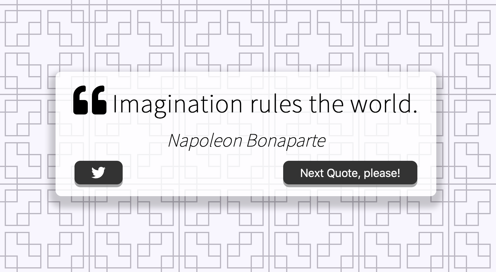

# Quote Generator

Quote Generator is an application that generates random quotes with their authors for the users with an option to tweet. 
It is a responsive and mobile friendly application that is written using HTML5, CSS3 and JavaScript.

# Live Project
[Click here](https://selenozkan.github.io/quote-generator) to check out the live project.

### Source of the project:
[Click here](https://www.udemy.com/course/javascript-web-projects-to-build-your-portfolio-resume) to access the project source.
